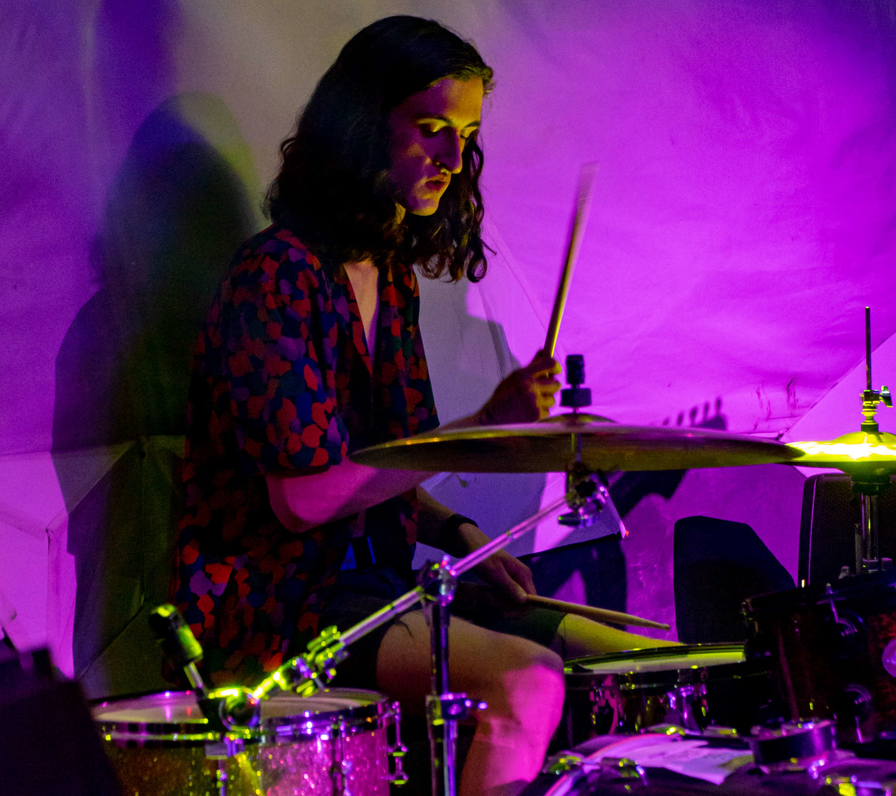

## Homepage

 

It feels like Moore's Law is about to end and, as an electrical engineer, I am very excited to have front-row tickets to the event.
I am interested in exploring how novel VLSI design techniques can be used to improve computer hardware without relying on ever-smaller process nodes.

Currently, I am a graduate student at Harvard University, where I perform research in neuromorphic engineering with the [Donhee Ham Lab](https://www.donheehamlab.org/). 
Previously, I worked on the CPU Cores physical design team at AMD and completed my undergraduate education at the Colorado School of Mines. 
I am also an alum of the Maine School of Science and Mathematics in my wonderful home state.

This site is a work-in-progress. I intend to use it mostly for discussion of engineering topics, but I reserve the right to post uninteresting content covering any topic of my interest.
