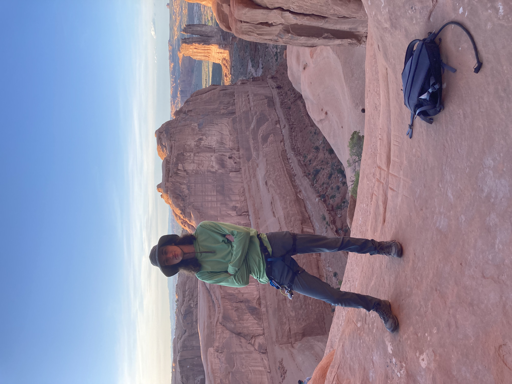

 

# Home
Hello, I'm TomHenry, and I'm an electrical engineer who works with integrated circuits. 

Currently, I am a graduate student in the [Donhee Ham Lab](https://www.donheehamlab.org/) at Harvard University.

Previously, I designed CPU cores at AMD, and earned a B.S. at the Colorado School of Mines. 

I am also an alum of the Maine School of Science and Mathematics in my bucolic, non-rhotic, home state.

For fun, [I play the drums](/drums.html), explore the outdoors, and [hack around on GNU/Linux](/setup.html). 
